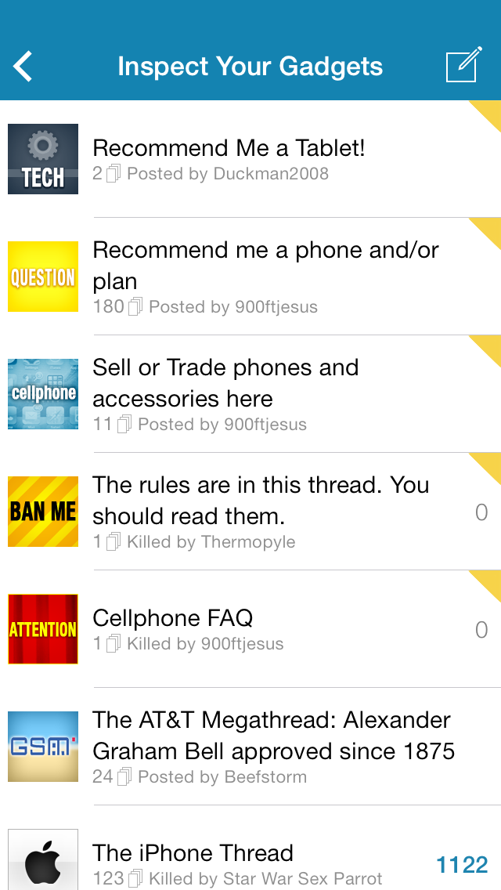

Awful
=====

[Awful][App Store] is an iOS 7 app that's *Better Than Safari* for browsing the [Something Awful Forums][forums]. Its story is told in [its thread][current thread] (and [its older thread][second thread] (and [its first thread][first thread])).

Development talk usually ends up in the [project.log][] thread, but we're not fussy.

<p align="center">
  
</p>

[App Store]: https://itunes.apple.com/app/awful-unofficial-something/id567936609
[forums]: http://forums.somethingawful.com
[current thread]: http://forums.somethingawful.com/showthread.php?threadid=3510131
[second thread]: http://forums.somethingawful.com/showthread.php?threadid=3381510
[first thread]: http://forums.somethingawful.com/showthread.php?threadid=3483760
[project.log]: http://forums.somethingawful.com/showthread.php?threadid=3564303

An unofficial app
-----------------

This app is not endorsed by Something Awful.

Build
-----

1. Clone the repository: `git clone --recursive https://github.com/Awful/Awful.app Awful-app`
2. Open Xcode project and build away: `open Awful-app/Awful.xcworkspace`

Debug builds, beta builds, and release builds each appear as separate apps (they have different bundle identifiers and display names). For development, choose the `Awful Beta` scheme, and an app called `Awful Debug` will be run in the iOS Simulator and on your device.

There are no required dependencies for building Awful; all third-party libraries are included, and files generated by other utilities are included in the repository.

There are optional dependencies for building Awful. You only need them if you're working on the relevant part of the app. Once a dependency is installed, simply build the Xcode project and the relevant files will be regenerated.

* [CocoaPods][] manages Objective-C library dependencies. If you're updating, adding, or removing a dependency, please [install CocoaPods][CocoaPods].
    * **Even if you add a dependency directly to the Xcode project**, you need to run `pod install` to update the acknowledgements section in the Settings screen. Licenses are added from the `Vendor` directory, either as a `LICENSE.txt` file or a properly-formatted comment atop a `.h` file.
* [LESS][] helps us write CSS. If you're modifying the themes for displaying posts (these are files like `posts-view*.less`), please [install LESS][LESS]:
    1. [Install homebrew](http://mxcl.github.com/homebrew/).
    2. Open Terminal and install node: `brew install node` (prepend `sudo` to avoid permissions errors).
    3. In Terminal, install less: `npm install less -g` (prepend `sudo` to avoid permissions errors).

There are unit tests for the HTML parsing, to help us find problems when markup changes, running continuously via [Travis CI][].

[](https://travis-ci.org/Awful/Awful.app)

[CocoaPods]: http://cocoapods.org/
[LESS]: http://lesscss.org/#usage
[Travis CI]: https://travis-ci.org/Awful/Awful.app

Distribute
----------

To build for [beta testing][TestFlight], change the scheme to "Awful Beta". Select "iOS Device", then from the `Product` menu choose `Archive`. A post-archive step will guide you through uploading the build to TestFlight, including writing release notes and tagging the version. To use the post-archive step, create a file called `api_keys`, in the root folder of the repository, that looks something like this:

```
TESTFLIGHT_API_TOKEN abc123abc123abc123
TESTFLIGHT_TEAM_TOKEN abc123abc123abc123
```

To build for the App Store, change the scheme to "Awful App Store". Select "iOS Device", then in the `Product` menu, choose `Archive`. A post-archive step will tag the git repository with the version specified in [Info.plist][].

If you want to use [Crashlytics][] for reporting crashes, create a file called `api_keys`, in the root folder of the repository, that looks something like this (or just add this line after your TestFlight keys from earlier):

```
CRASHLYTICS_API_KEY abc123abc123abc123
```

[Crashlytics]: https://www.crashlytics.com/
[Info.plist]: Xcode/Info.plist
[TestFlight]: http://testflightapp.com/

Contribute
----------

You can help! Head over to [Awful's thread][current thread] and tell us about any issues you're having. Send in some lovingly crafted [thread tags][]. Or [fork the code][fork] and send [pull requests][]. Once a pull request is accepted, you get the commit bit!

If you're curious about anything at all, stop by the [thread][current thread] and say hi.

[thread tags]: https://github.com/Awful/thread-tags#readme
[fork]: https://github.com/Awful/Awful.app/fork_select
[pull requests]: https://github.com/Awful/Awful.app/pulls

Data Flow
---------

The [HTTP client][] connects to the Something Awful Forums and parses its contents, saving those contents as [entities in a Core Data store][entities]. Various screens show the [forums][], [threads][], [posts][], [private messages][], and [users][] saved to the Core Data store.

Awful's Core Data store is a cache of content from the Forums. Any user info specific to the app is stored in [user defaults][]. The Core Data store may be (and can be, since it's stored in the application's Caches directory) deleted at any time.

[HTTP client]: Source/Networking/AwfulHTTPClient.h
[entities]: Source/Models
[forums]: Source/Forums
[threads]: Source/Threads
[posts]: Source/Posts
[private messages]: Source/Private%20Messages
[users]: Source/Users
[user defaults]: Source/Settings/AwfulSettings.h

Theming
-------

Awful's [posts view][] is fully customizable using CSS. There's a [default theme][], as well as themes for specific forums such as [YOSPOS][YOSPOS CSS theme] and [FYAD][FYAD CSS theme]. Internally, we use LESS to generate our CSS, so if you are editing built-in themes please edit the `.less` files. (LESS installation instructions are above.) Then commit both the modified `.less` files and any resulting changes to `.css` files, so others don't need LESS to build Awful.

The rest of Awful is themed in a a [big plist][theme plist]. If you can't find a theme key you'd like to use, ask and we'll add it!

[posts view]: Source/Posts/AwfulPostsView.h
[default theme]: Source/Theming/posts-view.css
[YOSPOS CSS theme]: Source/Theming/posts-view-219.less
[FYAD CSS theme]: Source/Theming/posts-view-26.less
[AwfulTheme]: Source/Theming/AwfulTheme.h
[theme plist]: Resources/Themes.plist

Thread Tags
-----------

[Diabolik900][] and [The Dave][] have fashioned Awful with its own [set of thread tags][thread tags] that look great on the iPhone and the iPad. They're distributed with the app. New thread tags can also [appear in Awful][AwfulThreadTags] without us having to send an update through the App Store. This is done by hosting the icons via [GitHub Pages][awfulapp.com].

To add a new thread tag you just made:

1. Add it to the [thread tags][] repository and push.
2. In the [awfulapp.com][] repository, update the `Thread Tags` submodule and push.
3. In this (Awful.app) repository, update the `Resources/Thread Tags` submodule and push.

[AwfulThreadTags]: Source/Networking/AwfulThreadTags.m
[awfulapp.com]: https://github.com/Awful/awful.github.io
[thread tags]: https://github.com/Awful/thread-tags

Assembling the AwfulPostsView
-----------------------------

The posts view uses [zepto.js][]. It gets concatenated with some custom JavaScript into `Resources/JavaScript/combined.js` during the Xcode build.

The standard build of zepto.js works fine, though it does include some unnecessary modules. Awful only uses `zepto` and `event`, so feel free to do a custom build with just those modules.

[zepto.js]: http://zeptojs.com/

License
-------

[Creative Commons Attribution-NonCommercial-ShareAlike 3.0 United States License](http://creativecommons.org/licenses/by-nc-sa/3.0/us/)

Credit
------

Awful development is led by [pokeyman][] aka [Nolan Waite](https://github.com/nolanw).

Awful includes contributions from:

- [Diabolik900][]
- [enigma105](http://forums.somethingawful.com/member.php?action=getinfo&userid=51258)
- [Froist](http://forums.somethingawful.com/member.php?action=getinfo&userid=56411)
- [hardstyle](http://forums.somethingawful.com/member.php?action=getinfo&userid=51070)
- [JamesOff](http://forums.somethingawful.com/member.php?action=getinfo&userid=32221)
- [Jose Valasquez](http://forums.somethingawful.com/member.php?action=getinfo&userid=77039)
- [Malcolm XML](http://forums.somethingawful.com/member.php?action=getinfo&userid=154586)
- [OHIO](http://forums.somethingawful.com/member.php?action=getinfo&userid=82915)
- [pokeyman][]
- [Subjunctive](http://forums.somethingawful.com/member.php?action=getinfo&userid=103253)
- [The Dave][]
- [ultramiraculous](http://forums.somethingawful.com/member.php?action=getinfo&userid=44504)
- [xzzy](http://forums.somethingawful.com/member.php?action=getinfo&userid=148096)

[Diabolik900]: http://forums.somethingawful.com/member.php?action=getinfo&userid=113215
[pokeyman]: http://forums.somethingawful.com/member.php?action=getinfo&userid=106125
[The Dave]: http://forums.somethingawful.com/member.php?action=getinfo&userid=41741