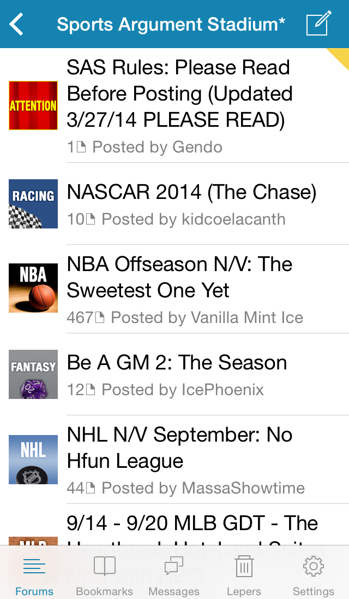

Awful
=====

[Awful][App Store] is an iOS app that's *Better Than Safari* for browsing the [Something Awful Forums][forums]. Its story is told in [its thread][current thread] (and [its older thread][second thread] (and [its first thread][first thread])).

<p align="center">
  
</p>

[App Store]: https://itunes.apple.com/app/awful-unofficial-something/id567936609
[forums]: http://forums.somethingawful.com
[current thread]: http://forums.somethingawful.com/showthread.php?threadid=3510131
[second thread]: http://forums.somethingawful.com/showthread.php?threadid=3381510
[first thread]: http://forums.somethingawful.com/showthread.php?threadid=3483760

An unofficial app
-----------------

This app is not endorsed by Something Awful.

Build
-----

1. Clone the repository: `git clone https://github.com/Awful/Awful.app`
2. Open Xcode project and build away: `cd Awful && open Awful.xcworkspace`

Debug builds, beta builds, and release builds each appear as separate apps (they have different bundle identifiers and display names). For development, choose the `Awful Beta` scheme, and an app called `Awful Debug` will be run in the iOS Simulator and on your device.

There are no required dependencies for building Awful; all third-party libraries are included, and files generated by other utilities are included in the repository.

There are optional dependencies for building Awful. You only need them if you're working on the relevant part of the app. Once a dependency is installed, simply build the Xcode project and the relevant files will be regenerated.

* [CocoaPods][] manages Objective-C library dependencies. If you're updating, adding, or removing a dependency, please [install CocoaPods][CocoaPods].
    * **Even if you add a dependency directly to the Xcode project**, you need to run `pod install` to update the acknowledgements section in the Settings screen. Licenses are added from the `Vendor` directory, either as a `LICENSE.txt` file or a properly-formatted comment atop a `.h` file.
* [LESS][] helps us write CSS. If you're modifying the themes for displaying posts (these are files like `posts-view*.less`), please [install LESS][LESS]:
    1. [Install homebrew](http://mxcl.github.com/homebrew/).
    2. Open Terminal and install node: `brew install node` (prepend `sudo` to avoid permissions errors).
    3. In Terminal, install less: `npm install less -g` (prepend `sudo` to avoid permissions errors).
* [mogenerator][] makes Objective-C classes from our Core Data model. If you're modifying the Core Data model (aka `Model.xcdatamodeld`), please [install mogenerator][mogenerator].

There are unit tests for the HTML parsing, to help us find problems when markup changes, running continuously via [Travis CI][].

[](https://travis-ci.org/Awful/Awful.app)

To install Awful-specific templates into Xcode (for new classes, protocols, etc.), run `Scripts/installtemplates` in Terminal. They're identical to built-in Xcode templates except for the copyright line.

[CocoaPods]: http://cocoapods.org/
[LESS]: http://lesscss.org/#usage
[mogenerator]: http://rentzsch.github.com/mogenerator/
[Travis CI]: https://travis-ci.org/Awful/Awful.app

Distribute
----------

To build for [beta testing][TestFlight], change the scheme to "Awful Beta".

To build for the App Store, change the scheme to "Awful App Store".

Either way, select "iOS Device", then in the `Product` menu, choose `Archive`.

If you want to use [Crashlytics][] for reporting crashes, create a file called `api_keys`, in the root folder of the repository, that looks something like this:

```
CRASHLYTICS_API_KEY abc123abc123abc123
```

[Crashlytics]: https://www.crashlytics.com/
[TestFlight]: http://testflightapp.com/

Contribute
----------

You can help! Head over to [Awful's thread][current thread] and tell us about any issues you're having. Send in some lovingly crafted [thread tags][]. Or [fork the code][fork] and send [pull requests][]. Once a pull request is accepted, you get the commit bit!

If you're curious about anything at all, stop by the [thread][current thread] and say hi.

[thread tags]: https://github.com/Awful/Awful.app/blob/master/Resources/Thread%20Tags/README.md#thread-tags
[fork]: https://github.com/Awful/Awful.app/fork_select
[pull requests]: https://github.com/Awful/Awful.app/pulls

Data Flow
---------

The [HTTP client][] connects to the Something Awful Forums and parses its contents, saving those contents as [entities in a Core Data store][entities]. Various screens show the [forums][], [threads][], [posts][], [private messages][], and [users][] saved to the Core Data store.

Awful's Core Data store is a cache of content from the Forums. Any user info specific to the app is stored in [user defaults][]. The Core Data store may be (and can be, since it's stored in the application's Caches directory) deleted at any time.

[HTTP client]: Source/Networking/AwfulHTTPClient.h
[entities]: Source/Models
[forums]: Source/Forums
[threads]: Source/Threads
[posts]: Source/Posts
[private messages]: Source/Private%20Messages
[users]: Source/Users
[user defaults]: Source/Settings/AwfulSettings.h

Theming
-------

Awful's [posts view][] is fully customizable using CSS. There's a [default theme][], as well as themes for specific forums such as [YOSPOS][YOSPOS CSS theme] and [FYAD][FYAD CSS theme]. Users can include their own custom themes by adding specially-named CSS files to the application Documents directory; [more info][custom CSS readme]. Internally, we use LESS to generate our CSS, so if you are editing built-in themes please edit the `.less` files. (LESS installation instructions are above.)

The rest of Awful's screens support much more limited theming for the "dark mode" setting. The color schemes are set in [AwfulTheme][]; there is no way to override them.

[posts view]: Source/Posts/AwfulPostsView.h
[default theme]: Source/Theming/posts-view.css
[YOSPOS CSS theme]: Source/Theming/posts-view-219.less
[FYAD CSS theme]: Source/Theming/posts-view-26.less
[custom CSS readme]: Resources/Custom%20CSS%20README.txt
[AwfulTheme]: Source/Theming/AwfulTheme.h

Thread Tags
-----------

[Diabolik900][] and [The Dave][] have fashioned Awful with its own [set of thread tags][thread tags] that look great on the iPhone and the iPad. They're 90px square PNG images (they're "retina", so they're displayed 45 points tall on the iPhone and iPad). Name them the same as the tag's filename on the Forums, but with `.png`. For example, the Apple tag is `shsc-apple.gif`, so call yours `shsc-apple.png`. Capitalization matters.

To add a new thread tag to the app, drag it into the Xcode project, in the `Resources/Thread Tags` group. Tick the box that says "Copy items into destination group's folder (if needed)". Then build the Xcode project. Now commit all your changes (the new thread tags plus `Awful.xcodeproj` and `tags.txt`) and send a pull request!

Thread tags are distributed with the app. New thread tags can also [appear in Awful][AwfulThreadTags] without us having to send an update through the App Store. This is done by hosting the icons via [GitHub Pages][], served at http://awfulapp.com. In order for this to work, ensure [tags.txt][] is up to date (i.e. build an Awful target in Xcode), then push to the `gh-pages` branch.

[AwfulThreadTags]: Source/Networking/AwfulThreadTags.m
[GitHub Pages]: https://help.github.com/categories/20/articles
[tags.txt]: tags.txt
[thread tags]: Resources/Thread%20Tags/

Assembling the AwfulPostsView
-----------------------------

The posts view uses [zepto.js][] (the default build) and some custom JavaScript, which get concatenated into `Resources/JavaScript/combined.js` during the Xcode build.

[zepto.js]: http://zeptojs.com/

Compatibility
-------------

Awful is loosely compatible with iOS 5. That means:

- It shouldn't crash. Use the [version category on UIDevice][UIDevice+OperatingSystemVersion] or feature detection to run code on certain versions of iOS.
- It should be usable. A toolbar has the wrong background? Not a big deal. The toolbar doesn't appear at all? We'll fix that.
- Polyfills/shims are great! (e.g. [PSTCollectionView][] provides UICollectionView on iOS 5.)

That said, if a compelling new feature requires iOS 6, and no polyfill is available, it's probably worth requiring iOS 6. So don't be afraid of suggesting/implementing such a feature!

[PSTCollectionView]: Vendor/PSTCollectionView
[UIDevice+OperatingSystemVersion]: Source/UIKit%20and%20Foundation/UIDevice+OperatingSystemVersion.h

License
-------

[Creative Commons Attribution-NonCommercial-ShareAlike 3.0 United States License](http://creativecommons.org/licenses/by-nc-sa/3.0/us/)

Credit
------

Awful development is led by [pokeyman][] aka [Nolan Waite](https://github.com/nolanw).

Awful includes contributions from:

- [Diabolik900][]
- [enigma105](http://forums.somethingawful.com/member.php?action=getinfo&userid=51258)
- [Froist](http://forums.somethingawful.com/member.php?action=getinfo&userid=56411)
- [hardstyle](http://forums.somethingawful.com/member.php?action=getinfo&userid=51070)
- [Jose Valasquez](http://forums.somethingawful.com/member.php?action=getinfo&userid=77039)
- [Malcolm XML](http://forums.somethingawful.com/member.php?action=getinfo&userid=154586)
- [OHIO](http://forums.somethingawful.com/member.php?action=getinfo&userid=82915)
- [pokeyman][]
- [The Dave][]
- [ultramiraculous](http://forums.somethingawful.com/member.php?action=getinfo&userid=44504)
- [xzzy](http://forums.somethingawful.com/member.php?action=getinfo&userid=148096)

[Diabolik900]: http://forums.somethingawful.com/member.php?action=getinfo&userid=113215
[pokeyman]: http://forums.somethingawful.com/member.php?action=getinfo&userid=106125
[The Dave]: http://forums.somethingawful.com/member.php?action=getinfo&userid=41741